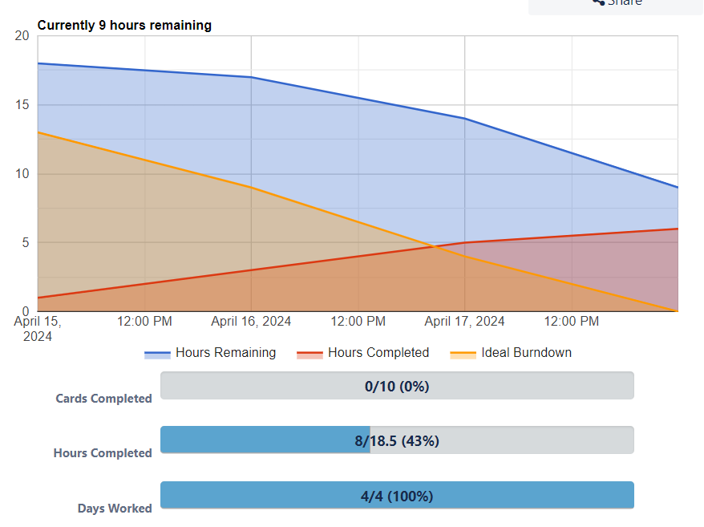
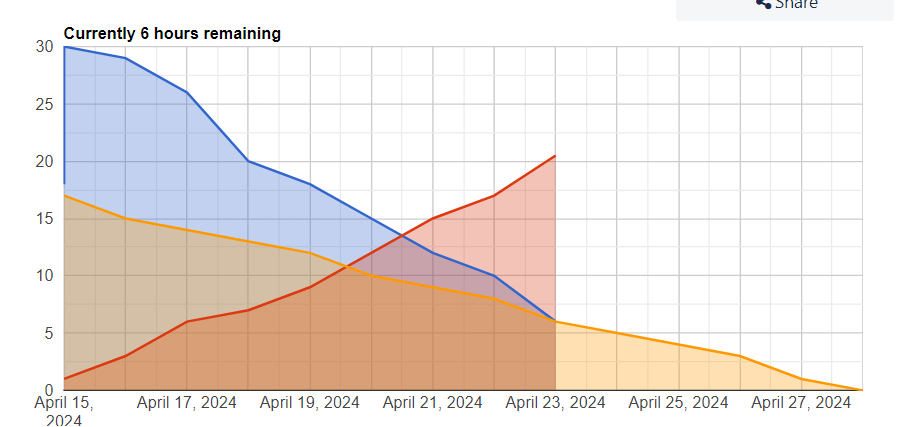
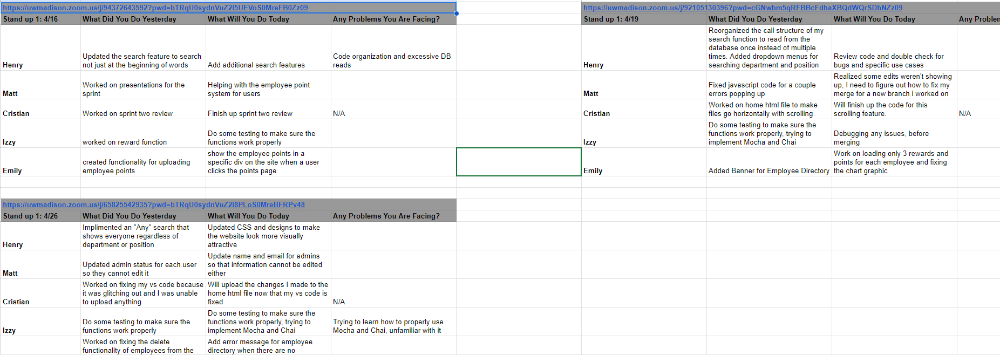
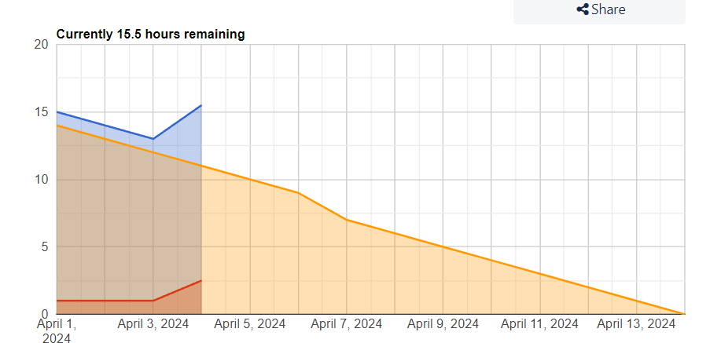
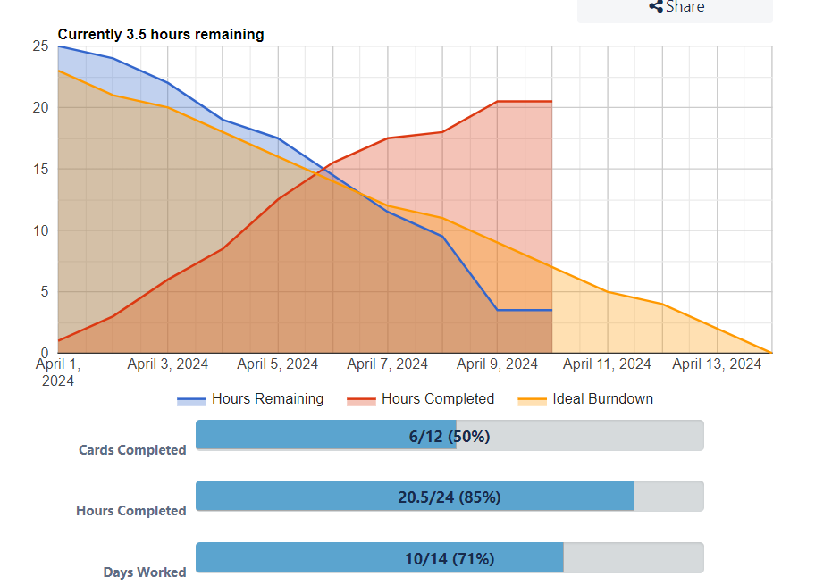
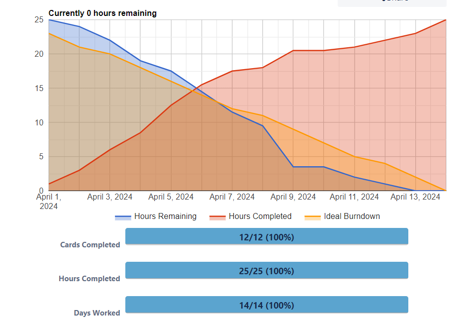
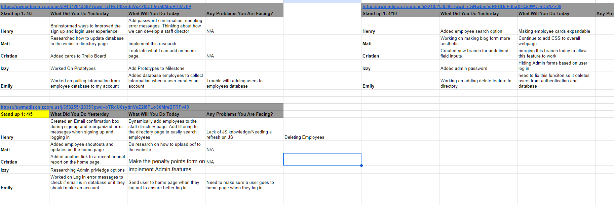
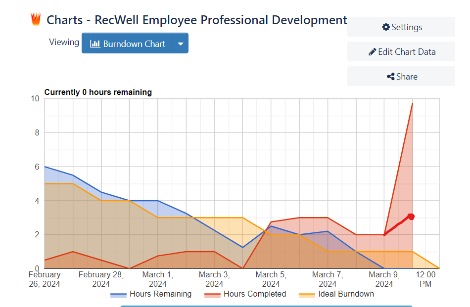

**Public Link:** https://github.com/izzyphan/RecWellDevelopment  
**Deployed Website URL:** https://rec-well-staff-w.web.app/home.html  
**Trello Board Link:** https://trello.com/invite/b/hF1aqcsp/ATTI1636d6626261721e7069d30e7d136cba7B7F52D6/recwell-employee-professional-development  

**Project Description:** This project currently holds the main page of our Rec Well Staff Website which is based on professional development and adding a database to hold their employee's information. This README file holds work conducted for the first sprint of the project as we focused on adding GUI of the home page. Below we have user stories, burndown charts, daily scrum meeting notes, and a review of the sprint.
___________________________________________________________________________________________________________________________________________________________________
**Sprint 3**   
**User Stories:**   
**User Story 1:**   
User Story 1: As an admin, I want to utilize an employee penalty point system that efficiently tracks each employees quanity of points. Also, these points will track what the point reason was, date, and can be viewed by the employee to offer consistent information in our program.    
**User Story 2:**   
User Story 2: As a student employee, I want a better way to show my appreciation for my coworkers. These shoutouts will be similar to a rewards system in which the recieving employee will see the data, reason, and who the reward was from.     
**User Story 3:**   
User Story 3: As an admin, I want to understand how to best use this system. This will help me implement the system into our program.    

**Breaking Down User Stories**
| Task                                                                                  | Corresponding Story Number (1-10) | Complexity (1-5) | Lead Person |
|---------------------------------------------------------------------------------------|-----------------------------------|------------------|-------------|
| Create a dynamic drop down menu for employee name for both penalty and rewards points | 5                                 | 3                | Emily       |
| Add more reason options for both penalty and rewards points                           | 1                                 | 1                | Cristian    |
| Create a message bar pop up using the existing JS function                            | 2                                 | 1                | Matt        |
| Use JS to create a new function for penalty point submission                          | 6                                 | 4                | Izzy        |
| Use JS to create a new function for rewards point submission                          | 6                                 | 4                | Izzy        |
| Use JS to pull rewards and points for logged-in non-admin employees                   | 8                                 | 5                | Henry       |
| Use JS to pull rewards and points for all employees (if admin)                        | 8                                 | 5                | Henry       |
| Use JS to display reward points on the home page for a specific time range            | 5                                 | 3                | Emily       |
| Remove all console errors                                                             | 5                                 | 3                | Emily       |
| Debug if needed                                                                       | 6                                 | 4                | Izzy        |

   
**Burn Down Chart Day 4, Day 9, Day 12**  
Day 4:  
 
Day 9: 
 
Day 12:   

**Evidence of 3 Daily Scrum Meetings:**

**Sprint Review 3:**
___________________________________________________________________________________________________________________________________________________________________
**Sprint 2**
 
 
**User Stories:**   

**User Story 1:**   
As an admin, I want to utilize an employee directory for our student staff which holds their personal information such as phone numbers, email, and a biography so I can better understand who they are and how I can contact them if need.   
**User Story 2:**   As a professional staff employee, I need to have different privledges on this website that allow me to add points and add blog posts. These are privleges that student staff will not have.   
**User Story 3:**   As an admin, I want to be able to upload blog posts at least every month. These blog posts are created as a pdf. I want to be able to easily upload a pdf to this website.    

**Breaking Down User Stories**
| Task                                                                                                                         | Corresponding Story Number | Complexity (1-5) | Lead Person |
|------------------------------------------------------------------------------------------------------------------------------|---------------------------|------------------|-------------|
| Create card layout on directory webpage                                                                                      | 8                         | 3                | Henry       |
| Add form for filters on directory webpage                                                                                    | 3                         | 1                | Cristian    |
| Implement functionality to click on an employee for more information                                                         | 5                         | 3                | Emily       |
| Add JavaScript functionality to the filters for the directory webpage                                                        | 5                         | 2                | Matt        |
| Develop JavaScript function to load employees into the directory webpage                                                     | 6                         | 4                | Henry       |
| Integrate admin privileges and determine how this feature will work                                                          | 8                         | 5                | Izzy        |
| Create form on Talent Turnstile webpage for uploading new blog posts                                                         | 6                         | 4                | Emily       |
| Make the upload form on Talent Turnstile webpage visible only for admins                                                     | 4                         | 3                | Izzy        |
| Make the penalty points form on the Points webpage visible only for admins                                                   | 4                         | 2                | Izzy        |
| Develop JavaScript functionality for the Talent Turnstile form to upload blog posts after submission of a file               | 6                         | 3                | Emily       

**Burn Down Chart Day 4, Day 9, Day 12**  
Day 4:  
 
Day 9: 
 
Day 12:   

**Evidence of 3 Daily Scrum Meetings:**

**Sprint Review 2:**

**a. What did you learn from doing our first sprint?**
We learned that our groups collaborate very well together. We were both very observant and able to provide constructive feedback both times. This led to our groups being very happy with our takeaways since we had a clearer picture of the areas we could improve on. 

**b. What did go well? Why?**
We still believe our communication went really well. Everyone was able to stay on the same page by consistently sending updates in our groupchat that we made. On top of that, we really capitalized on the time we had in class to work on the project when we were given it. Communication is an area that we feel we won't struggle with at all, given the methods we have set up and refined throughout the semester. 

**c. What didn’t go well? Why not?**
One area we think we could improve on again is time estimation. Although we knew this was an area we didn't do well during the first sprint, it was hard to improve on because we started adding increasingly more complex features to the website. Even by trying to break things down into smaller tasks, we found that when it came closer to the final version actually being complete, it was difficult. 

**d. How can you make things better next time?**
We think that going forward, we can be better by using historical evidence on top of breaking things down into smaller pieces. Now that we have a good amount of complex features on our website and we know how the timing went with those, we can factor that in to our new time estimations. 

**e. Are you satisfied with what you already completed?**
For sprint two, we feel the same as we did back in sprint one overall. We are happy with the visual design of our website. There are still a few small pieces we would like to refine, but in general we are very happy with what we have completed so far.

**f. Which group was invited? What are your observations/notes? Everybody was present?**
Group 2 was invited to our sprint review and everyone was present. Some feedback we received following the sprint review was that our timing estimations could be better. This is an area we struggled with during our first sprint as well, so we could really focus on it more going forward. They did mention that they believed our overall communication as a team was very good and it always seemed like everyone was on the same page. 

___________________________________________________________________________________________________________________________________________________________________
**MILESTONE 1**
**User Stories:**  
**User Story 1:**   
As RecWell student staff employee, I want access to a user-friendly website where I can easily manage and update my employee information, so that our professional team can better understand who I am and I can foster a cohesive work environment between other student staff members.

**Acceptance Criteria:**

-As a RecWell staff member, I can log in securely with my own email and password.  
-Upon logging in, I am presented with employee updates, an employee directory, and access to my own information.  
-I can easily navigate to sections for adding my own information, updating existing details, and viewing the entire staff directory.  
-I have an ability to create a centralized location for all training materials by scanning and uploading them to a portfolio.  
-I can easily view RecWell’s blog posts for targeted advice and tips for professional development aspects.  
-Under my account information, I am able to view how many penalty points I have and any endorsements I have received from other staff members.  
-The website is mobile-responsive, allowing easy access and functionality across different devices.  

**User Story 2:**  
As a RecWell professional staff member (full-time employee overseeing student staff), I want to access a more professional website featuring and focusing on our student staff members.

**Acceptance Criteria:**

-As the admin, I can log in securely with my unique credentials.  
-When adding a new employee, I can input necessary information such as name, contact details, position, and any relevant certifications or training completed. I also have the ability to update and delete this information.  
-I have the ability to search and filter the employee database based on different criteria such as name or position.  
-I can add blog posts and tips for students to add to their professional skills.  
-I can add important information to the home page to ensure staff have access to updates.  
-Using this website, I can track our penalty point system by assigning points to various staff members. These points also need to be cleared each semester.  
-The website is mobile-responsive, allowing easy access and functionality across different devices.  
-For the point and rewards system, I can define various actions or achievements that earn points, such as completing training modules, receiving positive feedback from peers or supervisors, or achieving performance milestones.  

**Breaking Down User Stories and Burndown Chart:**  
| Task | Corresponding Story Number | Duration | Priority | Complexity | Lead Person |
|-----------------------------------------------------------------------|----------------------------|-------------|----------|------------|-------------|
| Create Navigation Bar | 1 | 30 minutes | 10 | low | Emily |
| Connect Firebase to website to allow for sign in, sign up, log in | 5 | 1.5 hours | 8 | high | Henry |
| Add JS to navigation bar to hide all wepages until a user logs in | 3 | 45 minutes | 6 | medium | Henry |
| Add sign in, sign up, and log in modal to navigation bar | 7 | 2 hours | 6 | high | Emily |
| Add message bar to home page to let a user know they are logged in | 3 | 45 minutes | 3 | medium | Matt |
| Create a home page for users who are not logged in | 2 | 30 minutes | 8 | low | Henry |
| Create a home page that is a 1 column layout | 1 | 15 minutes | 2 | low | Emily |
| Create prototype in JustInMind for home page | 2 | 1 hour | 6 | low | Izzy |
| Add content to main section of home page | 3 | 45 minutes | 6 | low | Matt/Cristian |
| Add images to home page | 2 | 30 minutes | 5 | low | Cristian |

**Burn Down Chart Day 4, Day 9, Day 12**  
Day 4:  
 
This burn down chart does not accurately show the amount of work completed because our group did not know the graph depended on manual data entrance. We realized how to use this chart correctly after this screenshot was taken. The graph still showed us an accurate ideal burndown. We talked to the professor about this.
Day 9: 
 
Day 12:   
Our group could not figure out how to change the current day's total work completed because the burndown website only allowed us to edit past day's total work completed. I believe this error in our graph arised from closing tasks on day 12 even though work had been completed for these tasks on other days. We estimated we worked for 2.5 hours on day 12 and that is shown with the drawn in red dot and line to thr graph.

**Evidence of 3 Daily Scrum Meetings:**

**Sprint Review:**

**a. What did you learn from doing our first sprint?**  
We found that it was important to communicate what tasks were being currently worked on, completed, and still needed to be finished. This was important becuase it reduced the number of potential merge errors that we anticipated getting later in the project. We also found it was important for people to work on the parts of the website and development that matched their skills the best. 
 
**b. What did go well? Why?**  
One thing we believed we well was our communication. We were contantly conmmunicating to ensure that we were meeting deadlines, staying on track for budgeted time, and keeping the project in scope. We did this best through a groupchat that we had created where we can send questions and pictures and get quick responses instead of having to wait for in person conversations.
 
**c. What didn’t go well? Why not?**  
One area we think we could improve on is time estimation. We had created time estimations for each of our major sprint goals and most of the time they were inaccurate. One of the reasons we think this happened was becasue we had over estimated our skills and knowledge retention from previous courses.
 
**d. How can you make things better next time?**  
We think we can make things better, especially our time estimations, by break down each part and goal of our project into smaller pieces. This will be valuable as it will allow us to have a better understanding of how much time we still need to spend to hit our sprint goals. It will also allow more people to simultaneously work on one part of the project if it is broken up into smaller chunks.
 
**e. Are you satisfied with what you already completed?**  
We are happy with the visual design of our website. There are still a few small pieces we would like to refine, but in general we are very happy with what we have completed so far.
 
**f. Which group was invited? What are your observations/notes? Everybody was present?**  
Group 2 was invited to our sprint review. Some feedback we received following the sprint review was that during our sprint review, we effectively communicated evidence of the daily scrum and we were confident in our effort and unified in deciding what went well and what needs improving. We believe we are now well prepared for the next stage of the projet and will see further improvement in our future sprints. Yes, everybody was present for the sprint review.

Prototype:
After our meeting with the staff member's of Rec Well here was out initial Protype for both the Login/Sign-Up Screen and the Main Page. We were able to include the items that they needed:

We met with them and discussed what they were looking for:
- Wanted darker color scheme
- More simple
- Scrolling and all links showing on one page

Afterwards we met as a team and sketched out a new design for the main page and the login one. We took the news ideas out and it was close to what they envisioned. They also encouraged us to do what we think best and would best fit the site and their needs. Here is the new Prototype designs:

